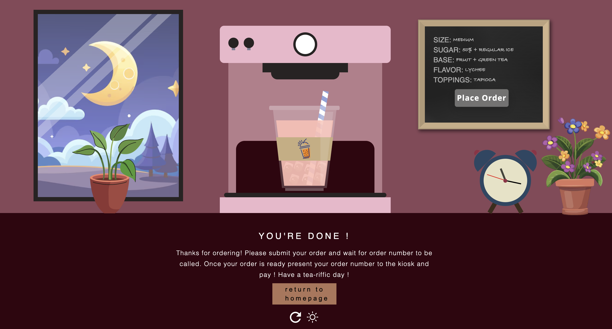

# Bubble Tea Project

## Overview
This is a simple web project that simulates a bubble tea shop. The site allows users to choose their bubble tea flavor, size, sweetness level, and toppings. Users can view a preview of their customized order before submitting it.

## Features
- Bubble tea flavor selection
- Size and sweetness level customization
- Multiple topping choices
- Order preview and submission



## Technologies Used
This project is built with the following technologies:
- HTML5
- CSS3 (with Flexbox and Grid)
- JavaScript (for interactivity)

## Installation
To run this project locally, follow these steps:

1. Clone the repository:
   ```sh
   git clone https://github.com/dshetty3/Bubble-Trouble-main.git
2. Open the index.html file in your preferred web browser. (Can use liver web)

## How to Use
- Choose the size of your drink.
- Set the level of sweetness.
- Select ice level.
- Select a flavor for your bubble tea.
- Pick your desired toppings.
- Click on 'Preview' to see your custom order.
- Click 'Submit' to finalize your order.

## License
This project is licensed under the MIT License - see the LICENSE file for details.


